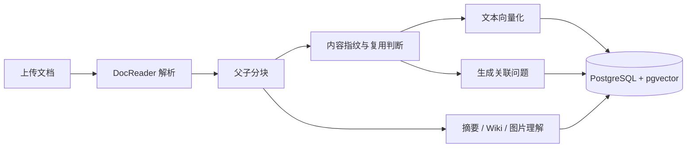
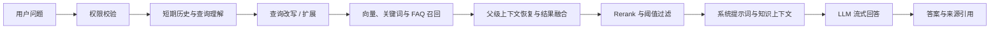
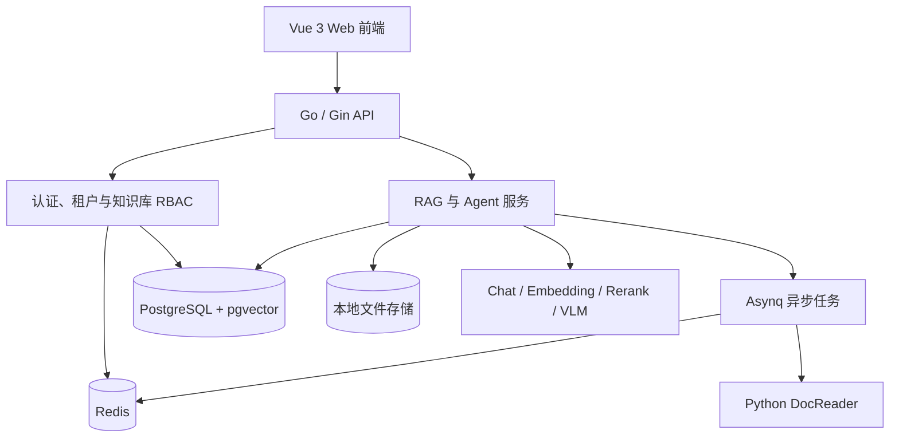

# ZgentFlow

[English](README_EN.md)

> 面向企业私有知识场景的本地优先 RAG 知识库系统。

ZgentFlow 覆盖从文档解析、父子分块、向量化存储、混合检索、Rerank 重排到大模型生成答案的完整链路，并提供文档重建复用、多租户数据隔离、知识库共享和细粒度成员权限控制。

与只完成“向量检索 + LLM”的基础 RAG 示例不同，ZgentFlow 更关注知识处理质量、重建成本、多用户协作和私有数据安全。

## 为什么需要 ZgentFlow

大模型参数中的知识无法持续更新，也无法直接覆盖企业内部文档。直接把整份文档塞进上下文，不仅成本高，还容易因为噪声和上下文长度限制降低答案质量。

ZgentFlow 将私有文档转换为可检索的知识，并在回答前完成查询理解、候选召回、上下文恢复和相关性重排，从而解决以下问题：

- 模型知识过时，无法随企业文档实时更新。
- 专业领域知识不足，回答容易出现事实性幻觉。
- 私有数据不适合上传到公共知识平台。
- 固定长度切块容易截断语义，导致召回结果失真。
- 文档或模型配置调整后全量重建成本过高。
- 多人共享知识时缺少清晰的数据边界和权限控制。

## 核心能力

### 完整的 RAG 工程链路

- 使用独立 DocReader 服务解析常见办公文档、网页、Markdown、PDF、图片等内容。
- 采用父子分块：子块负责精确检索，父级上下文负责恢复完整语义。
- 为文本块生成问题并建立额外索引，默认每块生成 3 个问题，可在知识库配置中调整。
- 同时支持向量、关键词和 FAQ 等检索来源，并对候选内容进行合并、去重和 Rerank。
- 支持查询改写、查询扩展、流式回答、来源引用以及可选的联网搜索。

### 可复用的知识重建

- 通过内容指纹识别未变化的文本块，避免重复切分和处理。
- 复用未变化块的 Embedding，减少模型调用和向量写入。
- 缓存 Wiki Map 阶段和图片 OCR/VLM 描述结果。
- 使用隐藏重建阶段和代际状态完成原子发布，避免半成品索引影响线上查询。
- 当重建失败时保留当前可用知识，便于后续重试。

### 多用户隔离与知识共享

- 每个注册用户拥有独立租户，知识库、文档、模型配置和本地文件默认相互隔离。
- 对话与短期记忆属于发起会话的用户，不因知识库共享而共享。
- 所有者可以开启知识库共享并生成邀请码；邀请码可重新生成，也可关闭。
- 新成员通过邀请码提交加入申请，经所有者或管理员批准后以读取用户身份加入。
- 共享关闭后禁止新的加入申请，但保留现有成员和权限。
- 成员操作写入知识库审计日志，便于追踪共享资源的变更。

### 认证与安全

- 用户名和密码登录。
- 邮箱地址和验证码登录。
- 用户名、邮箱、密码及邮箱验证码注册。
- 后端负责密码哈希、验证码、SMTP 发送、限流、Redis 会话、CSRF 和访问鉴权。
- 模型密钥和邮件授权码保存在 Git 忽略的 `.env` 或系统配置中，不进入前端代码。

## RAG 工作流程

### 文档入库



默认分块大小为 512、重叠长度为 50，并优先按段落、换行和中文句号切分。分块、问题生成、Embedding、摘要、Wiki 和图片理解均可根据知识库及模型配置调整。

### 用户问答



候选召回数量、向量阈值、Rerank 阈值和最终保留数量由配置控制，而不是写死在问答流程中。

## 系统架构



| 层级 | 技术与职责 |
| --- | --- |
| 前端 | Vue 3、TypeScript、Vite、Pinia、TDesign Vue Next |
| 后端 | Go、Gin、GORM，负责 API、业务编排、权限与模型调用 |
| 文档解析 | Python DocReader，通过 gRPC 与后端通信 |
| 数据存储 | PostgreSQL 保存业务数据，pgvector 保存向量，本地文件系统保存原始文档 |
| 异步任务 | Redis + Asynq，处理解析、索引、问题生成、Wiki 和重建任务 |
| AI 模型 | 可配置 Chat、Embedding、Rerank 和视觉模型，支持本地或远程供应商 |
| 可观测性 | 结构化日志、处理阶段追踪和可选 Langfuse 集成 |

## 知识库共享权限

权限从低到高分为读取用户、写入用户、管理员和所有者。

| 操作 | 读取用户 | 写入用户 | 管理员 | 所有者 |
| --- | :---: | :---: | :---: | :---: |
| 查看成员、文档、Wiki 和问答 | ✓ | ✓ | ✓ | ✓ |
| 预览或下载文档 | ✓ | ✓ | ✓ | ✓ |
| 上传新文档 |  | ✓ | ✓ | ✓ |
| 修改或删除文档 |  |  | ✓ | ✓ |
| 重建知识库索引 |  |  | ✓ | ✓ |
| 审批加入申请、查看审计日志 |  |  | ✓ | ✓ |
| 管理读取用户和写入用户 |  |  | ✓ | ✓ |
| 授予或管理管理员权限 |  |  |  | ✓ |
| 开关共享、重新生成邀请码 |  |  |  | ✓ |
| 修改配置或删除知识库 |  |  |  | ✓ |

邀请码在所有者关闭共享或重新生成前一直有效。申请批准后默认获得读取权限；管理员不能任命、降级或移除其他管理员，这类操作仅由所有者执行。

## 快速开始

### 环境要求

- Linux x86_64/amd64
- Go 1.26+
- Node.js 22+
- `make`、`gcc`、`curl`、`tar`、`openssl`

本地开发脚本会准备项目所需的 PostgreSQL、pgvector、Redis 和 DocReader 运行环境，不依赖 Docker。

### 1. 准备本地配置

```bash
cp .env.example .env
```

需要注册或邮箱验证码登录时，在 `.env` 中配置 SMTP。QQ 邮箱应使用邮箱授权码，而不是邮箱登录密码。

```dotenv
SMTP_HOST=smtp.qq.com
SMTP_PORT=587
SMTP_USERNAME=your-account@qq.com
SMTP_PASSWORD=your-authorization-code
SMTP_FROM=your-account@qq.com
SMTP_FROM_NAME=ZgentFlow
```

真实 `.env` 已被 Git 忽略，请勿把授权码、模型密钥或数据库密码提交到仓库。

### 2. 安装前端依赖

```bash
cd frontend
npm ci
cd ..
```

### 3. 启动后端及本地依赖

```bash
make dev-app
```

首次启动会下载或构建项目本地运行依赖，后续启动会复用 `.runtime/` 和 `.local-data/` 中的已有内容。后端默认监听 `0.0.0.0:8081`。

### 4. 启动前端

在另一个终端执行：

```bash
make dev-frontend
```

浏览器访问：

- 本机：`http://127.0.0.1:5173`
- 局域网：`http://<本机局域网IP>:5173`

### 5. 完成首次配置

1. 注册并登录账号。
2. 在系统设置中添加模型供应商和 API 配置。
3. 至少配置 Chat 和 Embedding 模型；Rerank 与视觉模型按需配置。
4. 新建知识库并选择对应模型。
5. 上传文档，等待解析和索引完成后开始问答。

### 停止本地依赖

```bash
make dev-stop
```

## 配置说明

| 配置项 | 默认值 | 用途 |
| --- | --- | --- |
| `ZEALRAG_APP_PORT` | `8081` | 后端 API 端口 |
| `ZEALRAG_DB_PORT` | `54329` | 本地 PostgreSQL 端口 |
| `ZEALRAG_REDIS_PORT` | `6389` | 本地 Redis 端口 |
| `ZEALRAG_DOCREADER_PORT` | `50061` | DocReader gRPC 端口 |
| `FRONTEND_BACKEND_URL` | `http://127.0.0.1:8081` | 前端开发代理目标 |
| `AUTH_COOKIE_SECURE` | `false` | HTTPS 部署时应设置为 `true` |
| `CORS_ALLOWED_ORIGINS` | 空 | 跨域部署时允许的前端来源 |

模型供应商、API Key 和联网搜索配置优先通过站内设置界面维护。RAG 默认参数和提示词位于 `config/config.yaml` 与 `config/prompt_templates/`。

## 本地数据

| 路径或组件 | 内容 |
| --- | --- |
| PostgreSQL + pgvector | 用户、知识库、文档元数据、会话、向量和任务状态 |
| `.local-data/files/` | 上传的原始文档 |
| `.local-data/` | PostgreSQL、Redis、日志及其他本地持久化数据 |
| `.runtime/` | 项目下载或构建的运行时与工具链 |

`.local-data/` 是本地业务数据而不是普通缓存。清理仓库或释放磁盘空间时不要误删该目录。

## 开发命令

```bash
# 构建 Go 后端
make build

# 运行 Go 测试
make test

# 检查类型并构建前端
cd frontend && npm run build-with-types
```

## 项目目录

```text
ZgentFlow/
├── cmd/server/                 # Go 服务入口
├── config/                     # 运行配置、内置模型与提示词
├── docreader/                  # Python 文档解析服务
├── frontend/                   # Vue 3 Web 前端
├── internal/
│   ├── agent/                  # Agent、工具、技能与短期记忆
│   ├── application/            # RAG 和业务服务
│   ├── handler/                # HTTP 接口处理
│   ├── infrastructure/         # 分块、解析、邮件和联网搜索
│   ├── middleware/             # 认证、权限、安全和审计
│   └── models/                 # Chat、Embedding、Rerank 与 VLM
├── migrations/versioned/       # PostgreSQL 版本迁移
├── scripts/zealrag/            # 本地运行环境编排脚本
├── .runtime/                   # 本地运行时，不提交 Git
└── .local-data/                # 本地业务数据，不提交 Git
```

## 当前能力边界

- Agent 记忆目前是会话级短期记忆，默认保留最近 5 轮上下文；尚未实现跨会话长期记忆和用户画像记忆。
- 当前 RAG 与 Agent 执行过程由后端预设管线编排；尚未提供用户可编辑的可视化 Workflow。
- 知识库共享已支持邀请、审批、成员角色和审计；所有权转让与站内通知中心仍属于后续规划。

## 兼容性说明

项目已更名为 ZgentFlow。`ZEALRAG_*` 环境变量、Go Module 路径以及 `scripts/zealrag/` 目录暂时保留，用于兼容现有本地数据和脚本。

## License

许可证与第三方组件声明见 [LICENSE](LICENSE)。
