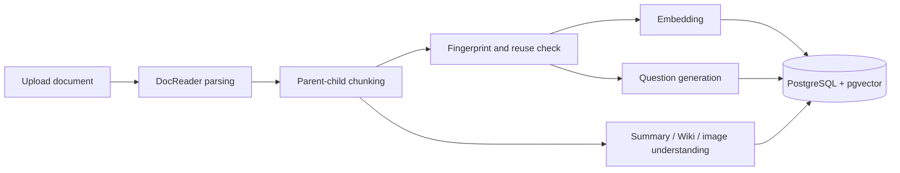
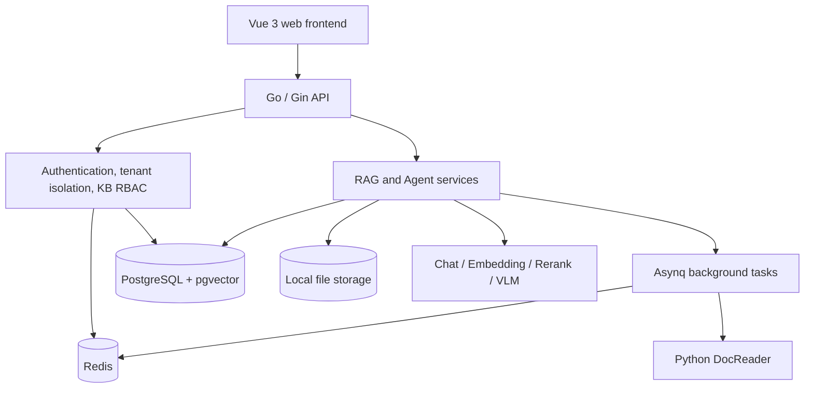

# ZgentFlow

[简体中文](README.md)

> A local-first RAG knowledge base for private and enterprise knowledge.

ZgentFlow covers the complete path from document parsing, parent-child chunking, and vector storage to hybrid retrieval, reranking, and LLM-generated answers. It also provides reusable rebuilds, multi-tenant isolation, knowledge base sharing, and fine-grained member permissions.

Unlike minimal “vector search + LLM” demos, ZgentFlow focuses on retrieval quality, rebuild cost, multi-user collaboration, and private-data security.

## Why ZgentFlow

Knowledge stored in model parameters cannot stay synchronized with internal documents. Sending entire documents to a model is expensive and often reduces answer quality because of noise and context limits.

ZgentFlow turns private documents into searchable knowledge and performs query understanding, candidate retrieval, context recovery, and relevance reranking before generating an answer. It is designed to address:

- Stale model knowledge that cannot follow internal document updates.
- Missing domain expertise and factual hallucinations.
- Private data that should not be placed in public knowledge platforms.
- Semantic damage caused by fixed-size chunk boundaries.
- Expensive full rebuilds after documents or model settings change.
- Unclear data boundaries and permissions in shared knowledge bases.

## Highlights

### End-to-end RAG pipeline

- A separate DocReader service parses common office documents, web pages, Markdown, PDFs, and images.
- Parent-child chunking uses child chunks for precise retrieval and parent context for semantic recovery.
- Generated questions create additional retrieval entries. The default is three questions per text chunk and is configurable per knowledge base.
- Vector, keyword, and FAQ retrieval sources are merged, deduplicated, and reranked.
- Query rewriting, query expansion, streaming answers, source citations, and optional web search are supported.

### Reusable knowledge rebuilds

- Content fingerprints identify unchanged text chunks and avoid unnecessary reprocessing.
- Embeddings for unchanged chunks are reused to reduce model calls and vector writes.
- Wiki map results and image OCR/VLM descriptions are cached.
- Hidden rebuild stages and generation state provide atomic publication of rebuilt indexes.
- The currently available knowledge remains intact when a rebuild fails.

### Multi-user isolation and sharing

- Each registered user owns an isolated tenant by default, including knowledge bases, documents, model settings, and local files.
- Conversations and short-term memory remain private to the user who started the session.
- An owner can enable sharing and generate, rotate, or disable an invitation code.
- Users submit join requests with the code. Approved users join with the reader role by default.
- Disabling sharing blocks new requests while preserving existing members and permissions.
- Shared-resource mutations are recorded in knowledge base audit logs.

### Authentication and security

- Username and password login.
- Email address and verification-code login.
- Registration with username, email, password, and email verification code.
- The backend owns password hashing, verification codes, SMTP delivery, rate limiting, Redis sessions, CSRF protection, and authorization.
- Model keys and email authorization codes stay in the Git-ignored `.env` file or protected system configuration.

## RAG Workflows

### Document ingestion



The default chunk size is 512 with an overlap of 50. Paragraph breaks, line breaks, and Chinese sentence boundaries are preferred split markers. Chunking, question generation, embeddings, summaries, Wiki generation, and image understanding are configurable.

### Question answering

```mermaid
flowchart LR
    A[User question] --> B[Access control]
    B --> C[Short-term history and query understanding]
    C --> D[Query rewrite / expansion]
    D --> E[Vector, keyword, and FAQ retrieval]
    E --> F[Parent context recovery and result fusion]
    F --> G[Rerank and threshold filtering]
    G --> H[System prompt and knowledge context]
    H --> I[Streaming LLM answer]
    I --> J[Answer with source citations]
```



Candidate limits, vector thresholds, rerank thresholds, and final result limits are configuration-driven rather than hard-coded in the chat pipeline.

## Architecture



| Layer | Technology and responsibility |
| --- | --- |
| Frontend | Vue 3, TypeScript, Vite, Pinia, and TDesign Vue Next |
| Backend | Go, Gin, and GORM for APIs, orchestration, authorization, and model calls |
| Document parsing | Python DocReader communicating with the backend over gRPC |
| Storage | PostgreSQL for business data, pgvector for vectors, and local storage for source documents |
| Background work | Redis and Asynq for parsing, indexing, question generation, Wiki, and rebuild tasks |
| AI models | Configurable Chat, Embedding, Rerank, and vision models from local or remote providers |
| Observability | Structured logs, processing-stage traces, and optional Langfuse integration |

## Knowledge Base Permissions

Roles are ordered from reader to writer, administrator, and owner.

| Operation | Reader | Writer | Administrator | Owner |
| --- | :---: | :---: | :---: | :---: |
| View members, documents, Wiki, and chat | ✓ | ✓ | ✓ | ✓ |
| Preview or download documents | ✓ | ✓ | ✓ | ✓ |
| Upload documents |  | ✓ | ✓ | ✓ |
| Update or delete documents |  |  | ✓ | ✓ |
| Rebuild the knowledge index |  |  | ✓ | ✓ |
| Review join requests and view audit logs |  |  | ✓ | ✓ |
| Manage readers and writers |  |  | ✓ | ✓ |
| Grant or manage administrator access |  |  |  | ✓ |
| Enable sharing or rotate invitation codes |  |  |  | ✓ |
| Update configuration or delete the knowledge base |  |  |  | ✓ |

An invitation code remains valid until the owner disables sharing or rotates the code. Approved requests receive reader access by default. Administrators cannot appoint, demote, or remove other administrators; these operations are reserved for the owner.

## Quick Start

### Requirements

- Linux x86_64/amd64
- Go 1.26+
- Node.js 22+
- `make`, `gcc`, `curl`, `tar`, and `openssl`

The local development scripts prepare PostgreSQL, pgvector, Redis, and DocReader without requiring Docker.

### 1. Prepare local configuration

```bash
cp .env.example .env
```

Configure SMTP in `.env` when registration or email-code login is needed. QQ Mail requires an authorization code instead of the mailbox login password.

```dotenv
SMTP_HOST=smtp.qq.com
SMTP_PORT=587
SMTP_USERNAME=your-account@qq.com
SMTP_PASSWORD=your-authorization-code
SMTP_FROM=your-account@qq.com
SMTP_FROM_NAME=ZgentFlow
```

The real `.env` file is ignored by Git. Never commit authorization codes, model keys, or production database passwords.

### 2. Install frontend dependencies

```bash
cd frontend
npm ci
cd ..
```

### 3. Start the backend and local dependencies

```bash
make dev-app
```

The first run downloads or builds project-local runtime dependencies. Later runs reuse `.runtime/` and `.local-data/`. The backend listens on `0.0.0.0:8081` by default.

### 4. Start the frontend

Run in another terminal:

```bash
make dev-frontend
```

Open:

- Local machine: `http://127.0.0.1:5173`
- LAN: `http://<your-lan-ip>:5173`

### 5. Complete the initial setup

1. Register and sign in.
2. Add a model provider and API configuration in system settings.
3. Configure at least Chat and Embedding models. Rerank and vision models are optional.
4. Create a knowledge base and select its models.
5. Upload documents and wait for parsing and indexing to finish.

### Stop local dependencies

```bash
make dev-stop
```

## Configuration

| Variable | Default | Purpose |
| --- | --- | --- |
| `ZEALRAG_APP_PORT` | `8081` | Backend API port |
| `ZEALRAG_DB_PORT` | `54329` | Local PostgreSQL port |
| `ZEALRAG_REDIS_PORT` | `6389` | Local Redis port |
| `ZEALRAG_DOCREADER_PORT` | `50061` | DocReader gRPC port |
| `FRONTEND_BACKEND_URL` | `http://127.0.0.1:8081` | Frontend development proxy target |
| `AUTH_COOKIE_SECURE` | `false` | Set to `true` behind HTTPS |
| `CORS_ALLOWED_ORIGINS` | empty | Allowed frontend origins for cross-origin deployments |

Model provider keys and web-search providers are normally managed through the application settings. Default RAG parameters and prompt templates live in `config/config.yaml` and `config/prompt_templates/`.

## Local Data

| Path or component | Contents |
| --- | --- |
| PostgreSQL + pgvector | Users, knowledge bases, document metadata, sessions, vectors, and task state |
| `.local-data/files/` | Uploaded source documents |
| `.local-data/` | PostgreSQL, Redis, logs, and other local persistent data |
| `.runtime/` | Downloaded or built runtimes and toolchains |

`.local-data/` contains business data and is not an ordinary cache. Do not delete it when cleaning the repository or reclaiming dependency-cache space.

## Development

```bash
# Build the Go backend
make build

# Run Go tests
make test

# Type-check and build the frontend
cd frontend && npm run build-with-types
```

## Project Layout

```text
ZgentFlow/
├── cmd/server/                 # Go server entry point
├── config/                     # Runtime configuration, built-in models, and prompts
├── docreader/                  # Python document parsing service
├── frontend/                   # Vue 3 web frontend
├── internal/
│   ├── agent/                  # Agents, tools, skills, and short-term memory
│   ├── application/            # RAG and application services
│   ├── handler/                # HTTP handlers
│   ├── infrastructure/         # Chunking, parsing, email, and web search
│   ├── middleware/             # Authentication, authorization, security, and auditing
│   └── models/                 # Chat, Embedding, Rerank, and VLM integrations
├── migrations/versioned/       # Versioned PostgreSQL migrations
├── scripts/zealrag/            # Local runtime orchestration scripts
├── .runtime/                   # Local runtimes, ignored by Git
└── .local-data/                # Local business data, ignored by Git
```

## Current Boundaries

- Agent memory is currently session-scoped short-term memory with five recent rounds by default. Cross-session long-term memory and user-profile memory are not implemented.
- RAG and Agent execution use backend-defined pipelines. A user-editable visual workflow builder is not currently available.
- Knowledge sharing includes invitation codes, approval, roles, and auditing. Ownership transfer and an in-app notification center remain planned work.

## Compatibility

The project has been renamed to ZgentFlow. The `ZEALRAG_*` environment variables, Go module path, and `scripts/zealrag/` directory are temporarily retained for compatibility with existing local data and scripts.

## License

See [LICENSE](LICENSE) for licensing terms and third-party notices.
